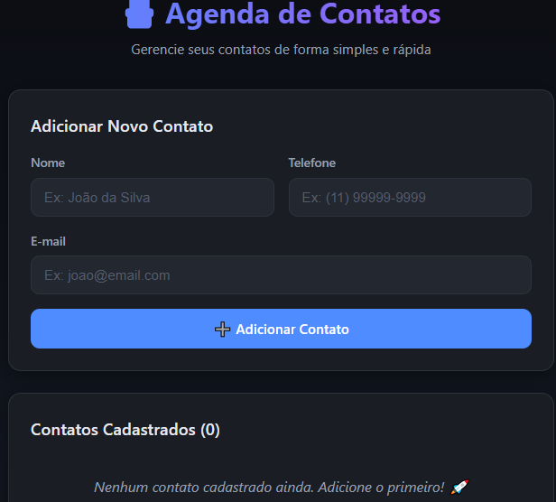

# 📇 Agenda de Contatos

Uma aplicação web simples e moderna para gerenciar contatos, construída com **Python + Flask** e armazenamento em **JSON**. Possui tema escuro, layout responsivo e é ideal para quem está aprendendo desenvolvimento web.


---

## ✨ Funcionalidades

- ➕ Adicionar contatos (Nome, Telefone, E-mail)
- 📋 Listar todos os contatos na página principal
- 🗑️ Excluir contatos com confirmação
- 💾 Persistência em arquivo JSON
- ⚠️ Validação de campos vazios com mensagens de feedback
- 🎨 Tema escuro moderno e responsivo
- 🔒 Uso de método `POST` para ações destrutivas

---

## 🖼️ Preview

> 
>
> 
> 
> 

---

## 🛠️ Tecnologias Utilizadas

| Camada       | Tecnologia            |
|--------------|-----------------------|
| Backend      | Python 3 + Flask      |
| Templates    | Jinja2 + HTML5        |
| Estilização  | CSS3 (tema escuro)    |
| Persistência | JSON                  |

---

## 📁 Estrutura do Projeto

```
agenda_contatos/
│
├── app.py                  # Servidor Flask e rotas
├── contatos.json           # "Banco de dados" em JSON
├── requirements.txt        # Dependências do projeto
├── .gitignore              # Arquivos ignorados pelo Git
├── README.md               # Este arquivo
│
├── static/
│   └── style.css           # Estilos (tema escuro)
│
└── templates/
    └── index.html          # Página principal
```

---

## 🚀 Como Executar Localmente

### Pré-requisitos

- Python 3.10 ou superior
- Git (opcional, para clonar)

### Passo a passo

```bash
# 1. Clone o repositório
git clone https://github.com/guicobracraft-prog/AgendaDeContatos.git
cd agenda_contatos

# 2. Crie um ambiente virtual
python -m venv venv

# 3. Ative o ambiente virtual
# Windows:
venv\Scripts\activate
# Linux / macOS:
source venv/bin/activate

# 4. Instale as dependências
pip install -r requirements.txt

# 5. Execute o servidor
python app.py
```

Acesse no navegador: **http://127.0.0.1:5000**

---

## 🧠 Como Funciona

1. O usuário preenche o formulário no navegador e clica em **Adicionar**.
2. O Flask recebe os dados via `POST` na rota `/adicionar`.
3. Os campos são validados (nada pode estar vazio).
4. O contato é salvo no arquivo `contatos.json`.
5. A página principal (`/`) relê o JSON e renderiza a lista atualizada.

---

## 🔌 Rotas da API

| Método | Rota                  | Descrição                          |
|--------|-----------------------|------------------------------------|
| GET    | `/`                   | Exibe a página principal           |
| POST   | `/adicionar`          | Adiciona um novo contato           |
| POST   | `/excluir/<id>`       | Exclui o contato com o ID informado|

---

## 🧪 Exemplo de contato salvo no JSON

```json
{
    "id": 1,
    "nome": "Maria Silva",
    "telefone": "(11) 99999-1111",
    "email": "maria@email.com"
}
```

---

## 📌 Próximas Melhorias (Roadmap)

- [ ] Editar contatos existentes
- [ ] Busca por nome ou e-mail
- [ ] Migrar para SQLite
- [ ] Autenticação de usuário
- [ ] Exportar contatos para CSV

---

## 🤝 Contribuindo

Contribuições são bem-vindas!

```bash
# 1. Faça um fork do projeto
# 2. Crie uma branch para sua feature
git checkout -b feature/minha-feature

# 3. Faça commit das suas alterações
git commit -m "feat: adiciona minha feature"

# 4. Faça push para sua branch
git push origin feature/minha-feature

# 5. Abra um Pull Request
```

---

## 📄 Licença

Este projeto está sob a licença **MIT**. Sinta-se livre para usar, estudar e modificar.

---

## 👤 Autor

Feito com 💙 por **[Guilherme]**

- GitHub: [@guicobracraft-prog](https://github.com/guicobracraft-prog)
---

⭐ Se este projeto te ajudou, deixe uma estrela no repositório!
